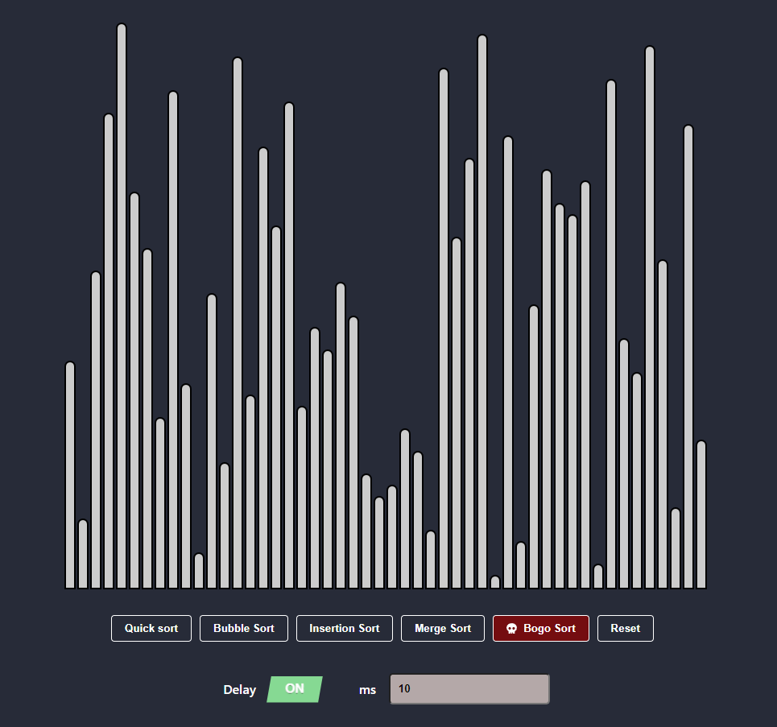

#

Explanation of each sorting algorithm in the provided code:

<ol><li>
Quick sort:
Quick sort is a divide-and-conquer sorting algorithm that sorts an array by selecting a pivot element and partitioning the other elements into two sub-arrays, according to whether they are less than or greater than the pivot. The sub-arrays are then recursively sorted. The key operation in quick sort is the partition operation, which rearranges the array so that all elements less than the pivot come before it, and all elements greater than the pivot come after it. Quick sort has an average time complexity of O(n log n), making it one of the most efficient sorting algorithms.
</li><li>
Bubble sort:
Bubble sort is a simple sorting algorithm that repeatedly steps through the list, compares adjacent elements and swaps them if they are in the wrong order. The pass through the list is repeated until the list is sorted. The algorithm gets its name from the way smaller elements "bubble" to the top of the list. Bubble sort has a time complexity of O(n^2), which makes it very inefficient for large lists.
</li><li>
Insertion sort:
Insertion sort is a simple sorting algorithm that builds the final sorted array one item at a time. It is much less efficient on large lists than more advanced algorithms such as quick sort, but is often used in small routines because of its simplicity. In insertion sort, the algorithm iterates through the input list and, for each element, inserts it into its correct position in the sorted list. The time complexity of insertion sort is O(n^2), which makes it less efficient than quick sort for large lists.
</li><li>
Merge sort:
Merge sort is a divide-and-conquer algorithm that recursively breaks down a list into sub-lists until each sub-list contains only one element. It then merges these sub-lists to create a larger sorted list. The merge operation combines two sorted sub-lists into a single sorted list, and is the key operation in the algorithm. Merge sort has a time complexity of O(n log n), making it one of the most efficient sorting algorithms.
</li><li>
Bogo sort:
Bogo sort, also known as permutation sort or stupid sort, is a notoriously inefficient sorting algorithm. It works by generating random permutations of the input list until it happens to generate the sorted list. The average time complexity of bogo sort is O(n!), which makes it completely impractical for any realistic application. Bogo sort is mainly used as an example of what not to do when designing a sorting algorithm.
</li></ol>

This is a React component that renders a visual representation of sorting algorithms. The component takes an array of integers as input and displays it as a series of columns, with each column's height corresponding to the value of the corresponding element in the array.

The component supports four sorting algorithms: bubble sort, insertion sort, quick sort, and bogosort. The sorting algorithms can be initiated by clicking the corresponding buttons, and a reset button is also available to shuffle the columns in a random order.

The component also allows for control of the sorting speed by adjusting the delay between each step of the sorting algorithm.

Here is the documentation for each function and variable:
<h3>Functions</h3><h4><code>Column</code></h4>
This is a functional component that renders a single column with a height proportional to the input value.
<h5>Props:</h5><ul><li><code>value</code> (number): the value of the element represented by the column</li><li><code>index</code> (number): the index of the element in the array</li></ul><h5>Return:</h5><ul><li>A <code>div</code> element with the <code>column</code> class and a style attribute that sets the height of the column based on the input value.</li></ul><h4><code>shuffle</code></h4>
This function takes an array as input and returns a new array with the same elements in a random order. The function uses the Fisher-Yates shuffle algorithm.
<h5>Parameters:</h5><ul><li><code>array</code> (Array): the input array to shuffle</li></ul><h5>Return:</h5><ul><li>A new array with the same elements as the input array, but in a random order.</li></ul><h4><code>ColumnList</code></h4>
This is the main functional component that renders the list of columns and the sorting controls.
<h5>Props:</h5><ul><li><code>values</code> (Array): the initial array of values to display as columns</li></ul><h5>State:</h5><ul><li><code>sortedValues</code> (Array): the current array of values to display as columns</li><li><code>withDelay</code> (Boolean): whether or not to include a delay between sorting steps</li><li><code>delay</code> (Number): the delay time in milliseconds between sorting steps</li><li><code>isSorting</code> (Boolean): whether or not a sorting algorithm is currently running</li></ul><h5>Methods:</h5><ul><li>
<code>sleep(ms)</code> (Async Function): a helper function that returns a promise that resolves after a specified delay.
<ul><li><code>ms</code> (Number): the delay time in milliseconds</li><li><code>Return</code>: A promise that resolves after the specified delay.</li></ul></li><li>
<code>bubbleSort()</code> (Async Function): a sorting algorithm that implements bubble sort.
<ul><li><code>Return</code>: None</li></ul></li><li>
<code>insertionSort()</code> (Async Function): a sorting algorithm that implements insertion sort.
<ul><li><code>Return</code>: None</li></ul></li><li>
<code>partition(arr, low, high)</code> (Async Function): a helper function used by the quicksort algorithm that partitions an array around a pivot.
<ul><li><code>arr</code> (Array): the array to partition</li><li><code>low</code> (Number): the starting index of the partition</li><li><code>high</code> (Number): the ending index of the partition</li><li><code>Return</code>: The index of the pivot element after partitioning.</li></ul></li><li>
<code>quickSort(arr, low, high)</code> (Async Function): a sorting algorithm that implements quicksort.
<ul><li><code>arr</code> (Array): the array to sort</li><li><code>low</code> (Number): the starting index of the partition (default: 0)</li><li><code>high</code> (Number): the ending index of the partition (default: arr.length - 1)</li><li><code>Return</code>: The sorted array.</li></ul></li><li>
<code>bogosort(arr)</code> (Async Function): a sorting algorithm that implements bogosort. (don't try it 🥴) 
<ul><li><code>arr</code> (Array): the array to sort</li><li><code>Return</code>: The sorted array.</li></ul></li><li>
<code>handleQuickSort()</code> (Async Function): a function that handles the click event on the Quick Sort button.
</li></ul>

### Getting Started with Create React App

This project was bootstrapped with [Create React App](https://github.com/facebook/create-react-app).

## Available Scripts

In the project directory, you can run:

### `npm start`

Runs the app in the development mode.\
Open [http://localhost:3000](http://localhost:3000) to view it in your browser.

The page will reload when you make changes.\
You may also see any lint errors in the console.
